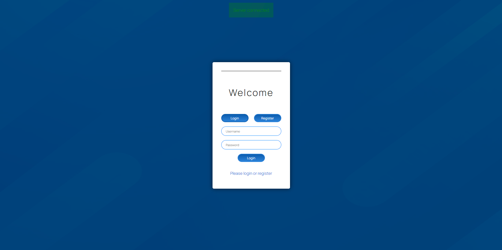
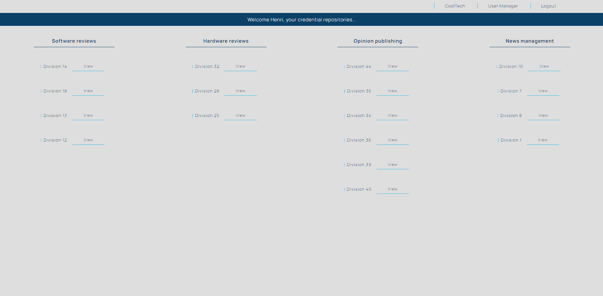
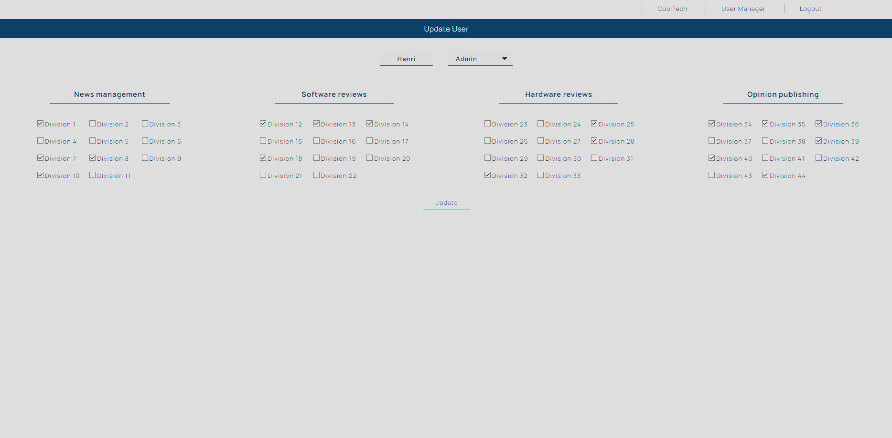
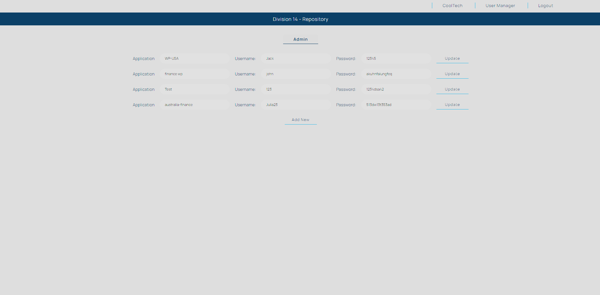

# Credential Management Web App

A user management system where each user has a role: Admin, Management, or Normal. Admins can assign management users to divisions, and management can assign credential repositories to normal users. The system ensures security with features like encryption, authentication, and role-based access control.

Table of contents
=================
<!--ts-->
   * [Live Link](#Live-Link)
   * [Features](#Features)
   * [Database](#Database)
   * [Security](#Security)
   * [Usage](#Usage)
   * [Testing Information](#Testing-Information)
        *  [Sample users](#Sample-users)
   * [Screenshots](Screenshots)
<!--te-->

## Live Link
NOTE: Due to the backend being hosted on Render Free Tier, the server sometimes takes less than 50 seconds start after initial load, thereafter requests should be almost instant.

[User Credential Manager](https://resplendent-pithivier-138605.netlify.app)

Login - Use one of the sample users below:
- Admin: username: `Henri` password: `justlogin`

- Management: username: `Jack` password: `superpassword`

- Normal: username: `James` password: `test123`

## Features
#### The Credential Management Web App offers the following features:

- User Authentication: Users can register and log in to the application securely.
- Access Control: All employees within a division have access to their respective division's credential repository.
- User Roles: Different user roles are available to ensure proper access control and permissions management.
- Organizational Units (OU): The following four OUs are defined within Cool Tech:
  - News Management
  - Software Reviews
  - Hardware Reviews
  - Opinion Publishing

## Database 
#### The database Users_DB, uses 4 collections:
- credentials, fields: _id, division id (used to link to a specific division), credentials list.
- divisions, fields: _id, division name, OU id (used to link to a specific OU).
- ous, fields: _id, OU name.
- users, fields: _id, username, password, role, divisions ids list (to link user to a specific division), OUs ids list (to link user to a specific OU).

#### 

- Utilizing mongoose models/schemas to interact with the database.
- 44 Divisions, 11 divisions for each OU, Sample data used.
- All divisions has a credential repo added/connected.

## Security

- JWT enabled, password encryption enabled.
- Permission control through the web app.
- PORT, MongoDB database url connection, JWT secret token stored in .env.

## Testing information

- Access granted to any ip address for MongoDB.

#### Login

You can create an account, some divisions and OU's are automatically assigned to new users.

#### Sample users

- Admin: username: `henri` password: `justlogin`

- Management: username: `jack` password: `superpassword`

- Normal: username: `james` password: `test123`

## Screenshots

*Screenshot 1: Login/Registration page*

*Screenshot 2: User landing, user specific divisions/credentials access*

*Screenshot 3: A specific division's credential repository*

*Screenshot 4: Admin page, manage user's access*

*Screenshot 5: Update a specific user's divisions/access*
