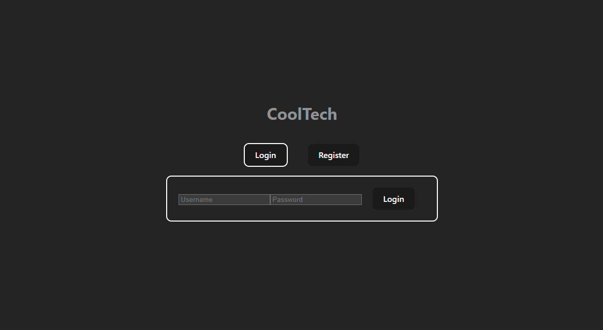
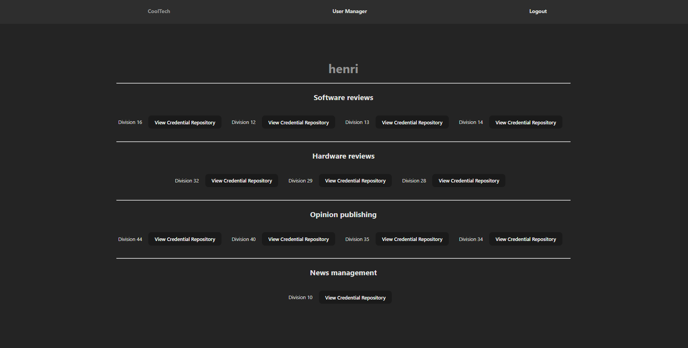
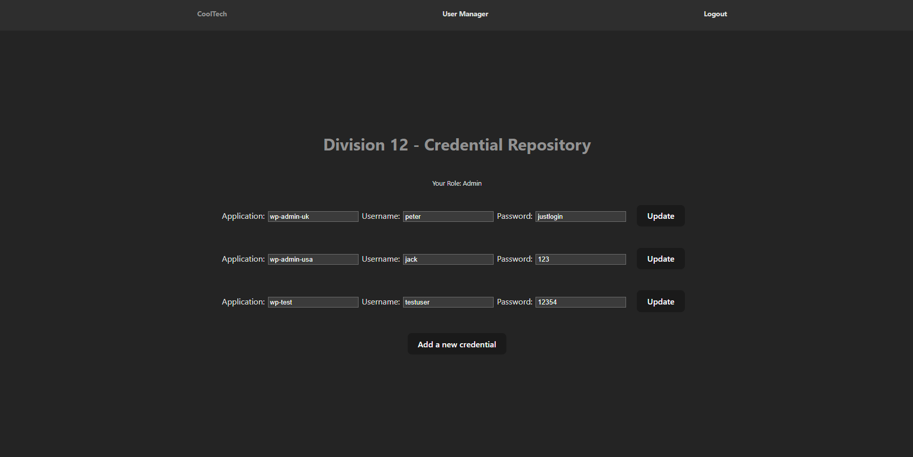
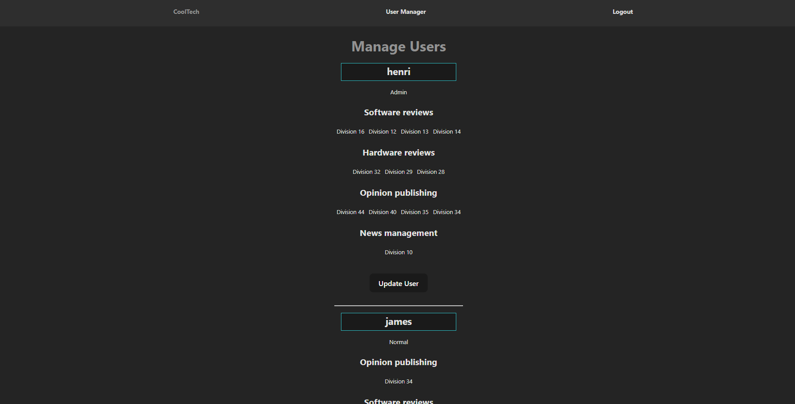
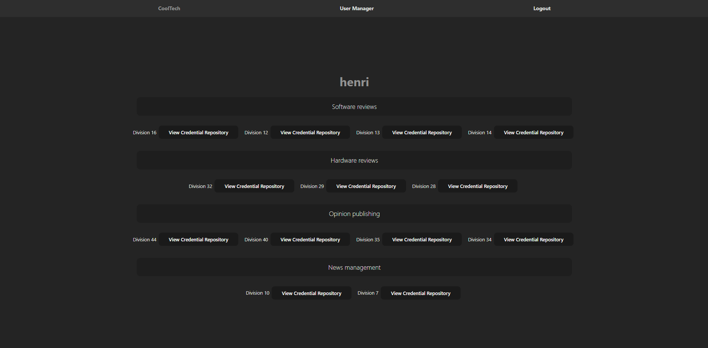

# Credential Management Web App

This is a web application built with the MERN stack (MongoDB, Express.js, React.js, Node.js) to address the credential management needs of Cool Tech. 
This project aims to be a centralized system to manage login details across multiple continents, languages, and websites. 
The application is built using the MERN stack. 

Table of contents
=================

<!--ts-->
   * [Live Link](#Live)
   * [Usage](#usage)
      * [STDIN](#stdin)
      * [Local files](#local-files)
      * [Remote files](#remote-files)
      * [Multiple files](#multiple-files)
      * [Combo](#combo)
      * [Auto insert and update TOC](#auto-insert-and-update-toc)
      * [GitHub token](#github-token)
      * [TOC generation with Github Actions](#toc-generation-with-github-actions)
   * [Tests](#tests)
   * [Dependency](#dependency)
   * [Docker](#docker)
     * [Local](#local)
     * [Public](#public)
<!--te-->

Live Link
============
NOTE: Due to the backend being hosted on Render Free Tier, the server takes 50 seconds start after initial load, thereafter requests should be almost instant.

So after clicking the link, please wait 50 seconds for backend to start.
[User Credential Manager](https://65ce0e98bac17706b51798e3--resplendent-pithivier-138605.netlify.app)

Login - Use one of the sample users below for instance:
- Admin: username: `henri` password: `justlogin`

## Features
#### The Credential Management Web App offers the following features:

- User Authentication: Users can register and log in to the application securely.
- Access Control: All employees within a division have access to their respective division's credential repository.
- User Roles: Different user roles are available to ensure proper access control and permissions management.
- Organizational Units (OU): The following four OUs are defined within Cool Tech:
  - News Management
  - Software Reviews
  - Hardware Reviews
  - Opinion Publishing

## Database 
#### The database Users_DB, uses 4 collections:
- credentials, fields: _id, division id (used to link to a specific division), credentials list.
- divisions, fields: _id, division name, OU id (used to link to a specific OU).
- ous, fields: _id, OU name.
- users, fields: _id, username, password, role, divisions ids list (to link user to a specific division), OUs ids list (to link user to a specific OU).

#### 

- Utilizing mongoose models/schemas to interact with the database.
- 44 Divisions, 11 divisions for each OU, Sample data used.
- All divisions has a credential repo added/connected.

## Security

- JWT enabled, password encryption enabled.
- Permission control through the web app.
- PORT, MongoDB database url connection, JWT secret token stored in .env.

## Usage

#### To use the app locally.
- Clone the repository
- Navigate to the backend & frontend via a terminal and type in both. `npm install`.
- Navigate to the backend & frontend via a terminal and type in both. `npm run dev`.

## Testing information

- Access granted to any ip address for MongoDB.

#### Sample users

- Admin: username: `henri` password: `justlogin`

- Management: username: `jack` password: `superpassword`

- Normal: username: `james` password: `test123`

## Screenshots

*Screenshot 1: Login/Registration page*

*Screenshot 2: User landing, user specific divisions/credentials access*

*Screenshot 3: A specific division's credential repository*

*Screenshot 4: Admin page, manage user's access*

*Screenshot 5: Update a specific user's divisions/access*
